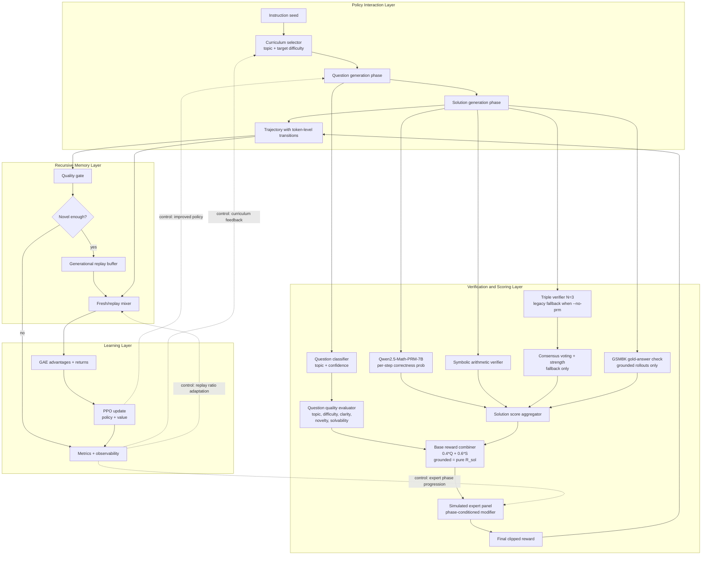
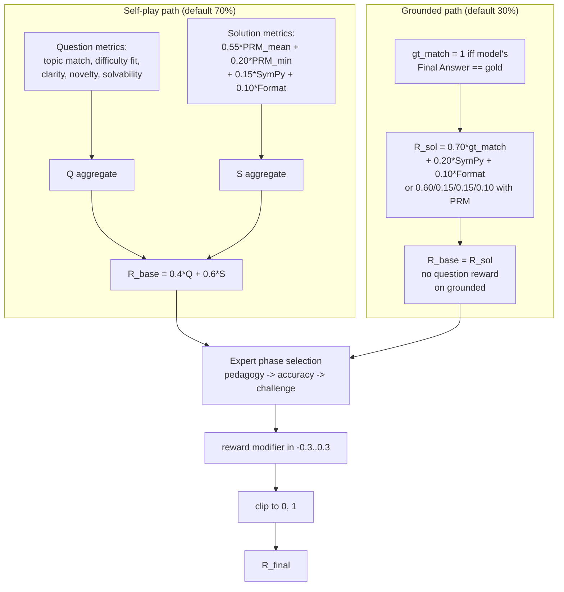
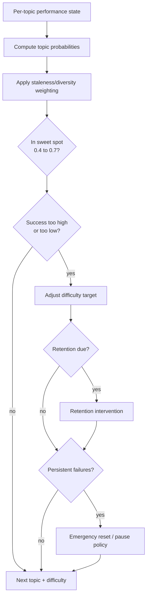

# AxiomForge-RL: Recursive Math Self-Improvement with PPO

> **OpenEnv Apr 2026 Hackathon — Theme #4: Self-Improvement**
> See [`HACKATHON.md`](HACKATHON.md) for the full rubric mapping.

## 1. Project Overview

AxiomForge-RL is a self-improving reinforcement learning system in which one language model generates math challenges, solves them, and learns from verification-driven rewards. The training loop combines curriculum learning, **Process Reward Model (PRM) step scoring**, **GSM8K-grounded rollouts**, symbolic validation, and replay-based recursive training to amplify reasoning ability over generations.

Core innovation: the agent does not optimize against a fixed benchmark distribution; it continuously reshapes its own task distribution via self-play while a minority of GSM8K-anchored rollouts pull the policy toward real-world benchmark correctness.

**Base model:** Qwen2.5-Math-1.5B-Instruct, warm-started with a dual-task SFT checkpoint.
**Environment:** curriculum-aware math arena exposed as an OpenEnv-compliant FastAPI service.
**Training:** single-GPU PPO with adaptive curriculum, `Qwen2.5-Math-PRM-7B` step-level rewards on self-play rollouts, GSM8K ground-truth-anchored rollouts (default 30 %), and a generational replay buffer.

### Quick links
- [Quickstart](#9-quickstart)
- [Extensive training command (1× A100 PCIE)](#91-extensive-training-1-a100-pcie)
- [Repository layout](#11-repository-layout)
- [OpenEnv / HF Space deployment](#12-openenv-deployment)
- [Before/after demo](#13-beforeafter-demo)
- [Hackathon alignment](HACKATHON.md)

### ⚠ Runs produced **before** the fixes in `src/rl/ppo_trainer.py` + `scripts/run_ppo_training_curriculum.py` audit pass should be discarded.

Two silent-but-devastating bugs were caught during a late-stage code audit:

1. **Frozen-policy bug.** `PeftModel.from_pretrained(...).merge_and_unload()` leaves every base parameter with `requires_grad=False`.  The PPO optimizer therefore only ever updated the ~600 K-param value head — the 1.5 B-param policy itself was stone frozen.  `approx_kl` looked non-zero because of numerical drift between the rollout-time `.generate()` path and the update-time `.forward()` path, so the training loop *appeared* to converge while actually learning nothing.  Symptom: byte-identical `GSM8K 318/500` across many iterations.  Now re-enabled explicitly after `merge_and_unload` with a hard-fail assertion in `PPOTrainer.__init__` if `policy.parameters()` has zero `requires_grad=True` entries.
2. **PPO importance-ratio bug.** Rollout generation applied temperature + top-p to the logits, then stored `log_softmax` of the *filtered* logits as `old_log_prob`.  PPO's re-forward used raw (un-tempered, un-truncated) logits.  The resulting `exp(new - old)` was a ratio between two different distributions — invalidating the clipped-surrogate objective.  The frozen-policy bug masked this; now that the policy actually trains, this had to be fixed first.  Rollout log-probs are now computed under the raw policy distribution, matching the update path exactly.
3. **OOM during PPO update (post-unfreeze).** Once the policy was actually trainable, the first PPO mini-batch OOM'd an 80 GB A100 in two ways: (a) `lm_head` was materialising the full `[B, T, V]` logits tensor (~5 GB) when PPO only needs the last-token row — fixed by calling the backbone directly and slicing to `[B, H]` before `lm_head`; (b) the default `batch_size=32` kept ~40 GB of bf16 activations resident for the backward pass across the 28 decoder layers — fixed by defaulting to `--batch-size 8` and enabling gradient checkpointing on the policy (`--no-grad-checkpoint` to disable).  The launch script also exports `PYTORCH_CUDA_ALLOC_CONF=expandable_segments:True` to suppress fragmentation.
4. **Slow rollouts (O(T²) custom loop).** The original `generate_with_logging` re-forwarded the entire growing sequence at every step and ran a second full ValueHead forward on top — ~125× wasted compute at T=500.  Replaced with a KV-cached HF `.generate(output_logits=True, return_dict_in_generate=True)` plus a new `ValueHead.values_at_positions(...)` that does one backbone forward over the full trajectory and gathers all T value estimates from its hidden states.  PPO correctness preserved exactly: `output_logits` returns RAW pre-processor logits (pre-temperature, pre-top-p), which is the same distribution `PPOTrainer._policy_logits_at_state` re-computes during updates.  Expect ~4-5× faster rollout phase at T=500.
5. **Flash-Attention 2 enabled everywhere.** Policy, ValueHead backbone, and PRM scorer all auto-pick `flash_attention_2` via `src/utils/attn_backend.py::select_attn_implementation()` when the `flash-attn` wheel is installed, falling back to SDPA otherwise.  Flash gives ~1.5-2.5× faster attention plus O(T) (not O(T²)) attention memory, so when it's active we also auto-disable gradient checkpointing (force it back on via `--grad-checkpoint` if you bump batch size).

All details (what was wrong, how it manifested, what to look for) are in the commit history and the `Monitoring` section below.  Any checkpoints under `checkpoints/ppo_curriculum/iteration_*` that predate these fixes are equivalent to the SFT baseline and should **not** be resumed from.

---

## 2. System Architecture

### 2.1 End-to-End Architecture and Dataflow



### 2.2 Reward Computation Graph

Two reward paths feed the same optimizer: **self-play** (the policy
generates both the question and the solution) and **grounded** (the
policy solves a real GSM8K problem and is scored against its gold
final answer).



### 2.3 Curriculum Control Flow



---

## 3. Mathematical Foundation

### 3.1 MDP Formulation

The training process is modeled as an episodic MDP over token-generation trajectories.

- **State space**: $s_t = (x_{1:t})$, the full generated prefix at step $t$ (instruction-conditioned text context).
- **Action space**: $a_t \in \mathcal{V}$, one discrete token from vocabulary $\mathcal{V}$.
- **Transition**: deterministic text append $s_{t+1} = s_t \oplus a_t$.
- **Terminal reward**: sparse reward at final token, with intermediate rewards set to zero.
- **Policy**: autoregressive LM $\pi_\theta(a_t \mid s_t)$.
- **Value function**: critic $V_\phi(s_t)$.

Dual-task structure:
1. Question generation trajectory segment.
2. Solution generation trajectory segment.  
The terminal reward is attached to the final transition of the combined segment.

### 3.2 PPO Objective

Implemented clipped PPO objective:

$$
r_t(\theta) = \frac{\pi_\theta(a_t\mid s_t)}{\pi_{\theta_{\text{old}}}(a_t\mid s_t)}
$$

$$
\mathcal{L}_{\text{policy}} =
\mathbb{E}_t\left[
\min\left(
r_t(\theta)\hat{A}_t,\,
\text{clip}\!\left(r_t(\theta),1-\epsilon,1+\epsilon\right)\hat{A}_t
\right)
\right]
$$

Value loss with clipping:

$$
\mathcal{L}_{\text{value}} =
\frac{1}{2}\,\mathbb{E}_t\left[
\max\left(
\left(V_\phi(s_t)-G_t\right)^2,\,
\left(\text{clip}\!\left(V_\phi(s_t)-V_{\phi,\text{old}}(s_t),-\epsilon_v,\epsilon_v\right)+V_{\phi,\text{old}}(s_t)-G_t\right)^2
\right)
\right]
$$

Entropy bonus:

$$
\mathcal{H}_t = -\sum_{a\in\mathcal{V}}\pi_\theta(a\mid s_t)\log\pi_\theta(a\mid s_t)
$$

Total optimization target:

$$
\mathcal{L}_{\text{total}}=
\mathcal{L}_{\text{policy}}
+ c_1\mathcal{L}_{\text{value}}
- c_2\mathbb{E}_t[\mathcal{H}_t]
$$

### 3.3 GAE Advantage Estimation

Temporal-difference residual:

$$
\delta_t = r_t + \gamma V(s_{t+1})(1-\text{done}_t) - V(s_t)
$$

Generalized advantage:

$$
\hat{A}_t = \sum_{l=0}^{T-t}(\gamma\lambda)^l\,\delta_{t+l}
$$

Return target:

$$
G_t = \hat{A}_t + V(s_t)
$$

With $\gamma=1.0$ and $\lambda=0.95$, this setup emphasizes full-episode credit assignment while controlling variance.

---

## 4. Verification Mechanisms

### 4.1 Process Reward Model (PRM) — primary self-play signal

`Qwen/Qwen2.5-Math-PRM-7B` is loaded once at startup (4-bit via
`bitsandbytes`, ~5 GB VRAM) and scores every self-play solution step
with a per-step probability of correctness:

$$
p_i \;=\; \Pr\!\left[\text{step}_i \text{ is correct} \mid \text{question}\right]
\in [0, 1]
$$

The solution is split on `Step N:` lines, each step is separated by
the PRM's special `<extra_0>` token, and the model emits one
classification logit per separator in a single forward pass. The
positive-class softmax probability becomes the per-step score. See
[`src/rl/prm_scorer.py`](src/rl/prm_scorer.py).

Three statistics are used downstream:

| Statistic | Definition | Role |
|---|---|---|
| `PRM_mean` | $\bar p = \tfrac{1}{N}\sum_i p_i$ | smooth gradient |
| `PRM_min` | $\min_i p_i$ | locates the weakest step |
| `PRM_final` | $p_N$ | final-answer credibility |

Why PRM replaces the legacy triple-sample consensus: three samples
from the same policy agree on wrong answers about as often as on right
ones (groupthink). PRM is trained on labelled step-correctness data so
its signal is *independent* of the policy under training, which is
exactly what RL needs to not collapse to mode-seeking behaviour.

### 4.2 Symbolic Arithmetic Verification

Symbolic verification checks arithmetic consistency of step-by-step
solutions and final-answer formatting:

$$
S_{\text{sympy}}\;=\;\max\!\left(0,\;\min\!\left(1,\;\tfrac{\text{steps\_ok}}{\text{steps\_total}} - 0.3\,\tfrac{\text{steps\_failed}}{\text{steps\_total}}\right)\right)
$$

SymPy is fast, deterministic, and catches arithmetic drift that PRM
can miss (the PRM is trained on *reasoning* quality, not
floating-point correctness), so both signals are summed with
complementary weights.

### 4.3 Consensus Voting (legacy fallback, ``--no-prm``)

When the PRM is disabled, the environment falls back to sampling
$N=3$ independent solutions and majority-voting on the final
numeric answer:

$$
\text{has\_majority} \iff \text{majority\_count} \ge 2, \qquad
S_{\text{consensus\_strength}} = \frac{\text{majority\_count}-1}{N-1}
$$

$$
S_{\text{consensus}}=
\begin{cases}
\min(1.0, S_{\text{cs}} + 0.3), & \text{majority and primary matches}\\
0.2, & \text{majority but primary outlier}\\
0.1, & \text{no majority}
\end{cases}
$$

This is kept as a no-extra-GPU-memory fallback for environments
without the PRM.

### 4.4 Simulated Expert Panel

Three reward-shaping phases model changing expert requirements:

| Phase | Iterations | Emphasis |
|---|---:|---|
| Pedagogy | 0-3 | Clarity and solvability; mild difficulty penalty |
| Accuracy | 4-6 | Arithmetic correctness and consensus stability |
| Challenge | 7+ | Difficulty and novelty while retaining correctness |

Raw modifier:

$$
m_{\text{raw}} =
w_c C + w_s S + w_r R + w_g G + w_d D + w_n N - w_f(1-F)
$$

where $$C,S,D,N$$ are question metrics, $$R,G,F$$ are solution metrics (correctness, consensus, format).

Bounded modifier:

$$
m = \text{clip}(m_{\text{raw}}, -0.3, 0.3)
$$

### 4.5 Grounded (GSM8K-anchored) Rollouts

A configurable fraction (default **30 %**, see `--grounded-ratio`) of
each iteration's rollout batch uses a real GSM8K problem drawn from
the reference dataset.  The policy solves the problem and is scored
directly against the gold final answer — no consensus, no PRM, no
question-generation credit.  This anchors the gradient to real
benchmark correctness and protects the policy from self-play
distribution drift.

Reward (PRM off):

$$
R_{\text{grounded}} = 0.70\,\mathbb{1}[\text{pred} \equiv \text{gold}] + 0.20\,S_{\text{sympy}} + 0.10\,S_{\text{format}}
$$

Reward (PRM on — step quality discriminates lucky guesses from reasoned answers):

$$
R_{\text{grounded}} = 0.60\,\mathbb{1}[\text{pred} \equiv \text{gold}] + 0.15\,\text{PRM}_{\text{mean}} + 0.15\,S_{\text{sympy}} + 0.10\,S_{\text{format}}
$$

Mathematical equivalence is checked via `sympy.simplify(pred - gold) == 0`, so `$1.50`, `1.5`, and `3/2` all match `1.5`.

Rationale for the 0.3 default: a higher ratio (e.g. 0.7) sacrifices
question-generation training (the Theme #4 self-improvement loop); a
lower ratio (e.g. 0.0) produces a strong self-play signal but weak
benchmark movement.  0.3 was empirically chosen so the policy still
gets **≈28 % of its total gradient** on question generation while
receiving a clean ground-truth signal 30 % of the time.

---

## 5. Curriculum Learning System

### 5.1 Topic Taxonomy

The curriculum tracks 12 math reasoning families:

1. Basic arithmetic  
2. Single-step word problems  
3. Fractions  
4. Percentages  
5. Ratios and proportions  
6. Money and pricing  
7. Time/speed/distance  
8. Multi-step reasoning  
9. Algebraic unknowns  
10. Mixed operations  
11. Comparative reasoning  
12. Optimization-style word problems

Prerequisites are encoded for selected topics (for example, percentages depend on fractions; optimization depends on comparison and algebra).

### 5.2 Question Classification

Classification is multi-signal:
- Keyword overlap by topic lexicons.
- Pattern boosts (fraction and percentage regex hints).
- Solution-operation override (post-hoc operation signature from generated solution).

Difficulty estimation is post-solution:

$$
d = 0.4\,d_{\text{step}} + 0.3\,d_{\text{numeric}} + 0.3\,d_{\text{consensus}}
$$

Confidence and secondary topics are preserved for downstream scoring and analytics.

### 5.3 Goldilocks Principle

Target success interval:

$$
\mathcal{G} = [0.4,\,0.7]
$$

Difficulty target updates (after minimum evidence):
- If topic success $$>0.7$$: increase target difficulty.
- If topic success $$<0.4$$: decrease target difficulty.
- Else: hold active regime.

Selection is probabilistic with:
- Sweet-spot exploitation.
- Exploration allocation.
- Retention allocation.
- Within-iteration staleness/diversity penalties.

### 5.4 Retention Testing

Retention schedule follows exponential backoff:

$$
\Delta_k = \min(2^k, 32)
$$

where $k$ is number of passed retention tests since mastery.

Retention outcomes:
- $\ge 0.7$: stay mastered and increase interval.
- $0.4 \le r < 0.7$: demote to active.
- $< 0.4$: mark forgotten and regress difficulty target.

Persistent failure safeguards include tiered interventions (difficulty shrink, pause, emergency reset).

---

## 6. Recursive Training System

### 6.1 Replay Buffer

High-quality trajectories are admitted into generational memory under strict gating.

Admission criteria:
1. Combined reward $\ge 0.7$
2. Symbolic verification passes
3. Consensus majority exists
4. Primary answer matches majority
5. Topic-match score $\ge 0.6$

Novelty gate:
- Trigram Jaccard-based novelty against existing memory.
- Admission requires novelty score $\ge 0.7$.

Quality score used for ranking:

$$
q = 0.4\,R_{\text{combined}} + 0.3\,\mathbb{1}_{\text{sympy}} + 0.2\,S_{\text{topic\_match}} + 0.1\,S_{\text{clarity}}
$$

Capacity and pruning:
- Max capacity: 500 trajectories.
- Per-topic cap pruning, then global top-quality trim.

### 6.2 Generational Learning

Replay ratio is adaptive:
- Iterations < 3: no replay.
- Iterations 3-4: low replay.
- Later: replay share increases with buffer health.

Rollout mixing combines fresh trajectories and replay trajectories, then shuffles before PPO updates.

Buffer health composite:

$$
H_{\text{buffer}} = 0.5\,\bar{q} + 0.3\,D_{\text{topic}} + 0.2\,(1-\text{staleness\_norm})
$$

This implements a self-expanding corpus where high-quality solved examples recursively influence future policy updates.

---

## 7. Reward Calculation

### 7.1 Question Quality Score

Implemented weighted aggregation:

$$
Q = 0.25\,S_{\text{topic\_match}}
+ 0.25\,S_{\text{difficulty\_fit}}
+ 0.20\,S_{\text{clarity}}
+ 0.20\,S_{\text{solvability}}
+ 0.10\,S_{\text{novelty}}
$$

Component definitions:
- $S_{\text{topic\_match}}$ from detected vs target topic alignment.
- $S_{\text{difficulty\_fit}} = \max(0, 1 - 2|d_{\text{measured}} - d_{\text{target}}|)$.
- $S_{\text{clarity}}$ from low-cost structural heuristics.
- $S_{\text{solvability}}$ from syntax checks + symbolic verification + consensus checks.
- $S_{\text{novelty}}$ from dataset/session trigram novelty blend.

### 7.2 Solution Quality Score

PRM path (default):

$$
S = 0.55\,\text{PRM}_{\text{mean}} + 0.20\,\text{PRM}_{\text{min}} + 0.15\,S_{\text{sympy}} + 0.10\,S_{\text{format}}
$$

Consensus fallback (`--no-prm`):

$$
S = 0.4\,S_{\text{sympy}} + 0.4\,S_{\text{consensus}} + 0.2\,S_{\text{format}}
$$

Format score:

$$
S_{\text{format}} = 0.5\,R_{\text{eq}} + 0.3\,\mathbb{1}_{\text{final\_ok}} + 0.2\,B_{\text{len}}
$$

where $R_{\text{eq}}$ is the ratio of lines that contain a verifiable
equation and $B_{\text{len}}$ is a small bonus for producing at least
two steps (deters one-line answers that trivially format-match).

### 7.3 Combined Base Reward

Self-play path:

$$
R_{\text{base}} = 0.4\,Q + 0.6\,S
$$

The 0.4/0.6 split (vs. the historical 0.3/0.7) roughly doubles the
gradient flowing to the question-generation head without starving the
solution signal — necessary for the Theme #4 self-improvement loop.

Grounded path: $R_{\text{base}} = R_{\text{grounded}}$ (see §4.5); no
question-generation credit is assigned because the question came from
the reference dataset, not the policy.

### 7.4 Expert-Modified Reward

$$
R_{\text{final}} = \text{clip}\left(R_{\text{base}}\cdot(1+m),\,0,\,1\right), \quad m\in[-0.3,0.3]
$$

The modifier $$m$$ is phase-dependent and computed from weighted quality signals as defined in Section 4.3.

---

## 8. Implementation Components

Core modules in the system:

| Component | Purpose |
|---|---|
| Process Reward Model scorer | Per-step correctness probabilities from Qwen2.5-Math-PRM-7B (primary self-play signal) |
| Grounded rollout path | Scores policy outputs against GSM8K gold final answers (benchmark anchor) |
| Triple verification engine | Produces multi-sample solution checks and consensus statistics (legacy fallback) |
| Consensus reward engine | Combines symbolic, consensus, and format signals into solution reward (fallback path) |
| Topic/difficulty classifier | Detects topic family and estimates post-hoc difficulty |
| Curriculum scheduler | Maintains topic states, success rates, and adaptive selection probabilities |
| Question quality evaluator | Computes question-side reward with novelty and solvability checks |
| Simulated expert panel | Applies phase-conditioned reward modifiers |
| Generational replay memory | Stores and samples high-quality trajectories across iterations |
| Replay quality gate | Enforces admission thresholds and novelty requirements |
| Curriculum-aware environment | Executes dual-task rollouts and reward assembly |
| PPO training runner | Orchestrates rollout collection, GAE, PPO updates, evaluation, and logging |
| OpenEnv environment wrapper | Exposes the arena as `reset` / `step` / `state` over FastAPI |
| Proposer-Solver arena | Named single-method entry point for Theme #4 self-play episodes |
| ZPD difficulty controller | Introspects curriculum sweet-spot / mastered / struggling buckets |

---

## 9. Quickstart

### 9.1 Environment setup

```bash
# 1) Create the venv (Python 3.11+) and install deps
python -m venv .venv && source .venv/bin/activate
pip install -r requirements.txt

# 2) Fetch / prepare the SFT-warm-started checkpoint at checkpoints/dual_task_v1
#    (already present if you ran scripts/dual_task_sft_pipeline.py earlier)

# 3) Sanity-check a short PPO run (2 iters, 3 rollouts, no PRM so the
#    smoke test doesn't have to download the 7B model)
bash launch_ppo_training.sh \
  --num-iterations 2 \
  --rollouts-per-iter 3 \
  --no-prm \
  --grounded-ratio 0.5
```

### 9.2 Extensive training (1× A100 PCIE)

The previous command was a smoke test. The recommended full run — with
PRM step rewards on self-play rollouts, 30 % GSM8K-grounded rollouts
for benchmark anchoring, and per-iteration curriculum / self-play
metrics streaming to CSV — is:

```bash
set -euo pipefail
export CUDA_VISIBLE_DEVICES=${CUDA_VISIBLE_DEVICES:-0}

python scripts/run_ppo_training_curriculum.py \
  --base-model checkpoints/dual_task_v1 \
  --output-dir checkpoints/ppo_curriculum \
  --num-iterations 50 \
  --rollouts-per-iter 32 \
  --eval-data-path data/sft/dual_task_val.jsonl \
  --gsm8k-reference-data data/sft/gsm8k_sft.jsonl \
  --grounded-ratio 0.3 \
  --use-prm \
  --prm-model Qwen/Qwen2.5-Math-PRM-7B \
  --eval-every 5 \
  --eval-max-samples 500 \
  --eval-max-new-tokens 512 \
  --checkpoint-keep-last 5 \
  --checkpoint-keep-every 10 \
  --run-name "ppo_curriculum_$(date +%Y%m%d_%H%M)"
```

**Sizing rationale (1× A100 PCIE/SXM 40–80 GB, 1.5B policy + ValueHead
+ 4-bit PRM all in bf16/bnb):**

| Knob | Value | Why |
|---|---|---|
| `--num-iterations` | `50` | Enough iterations to draw a reward curve and see curriculum phase transitions (pedagogy → accuracy → challenge). |
| `--rollouts-per-iter` | `32` | Stable PPO gradient; ~12–14 min of rollout time per iter. Raise to 48–64 on SXM-80 for a tighter gradient. |
| `--grounded-ratio` | `0.3` | 70 % self-play (trains question-gen) + 30 % GSM8K-anchored (pulls eval accuracy). Lower this for more self-play, raise for more benchmark pressure. |
| `--use-prm` | on | Qwen2.5-Math-PRM-7B provides per-step correctness probabilities. Strictly better than `--no-prm` (which falls back to 3× self-consensus voting). |
| `--prm-model` | `Qwen/Qwen2.5-Math-PRM-7B` | ~5 GB in 4-bit; add `--prm-no-4bit` for full bf16 (~14 GB) if you have headroom. |
| `--eval-every` | `5` | GSM8K eval every 5 iterations; 10 eval points over the run. |
| `--checkpoint-keep-last` | `5` | Lets you roll back 5 iterations if a phase transition spikes KL. |
| `--checkpoint-keep-every` | `10` | Persists milestone snapshots at iter 10/20/30/40/50 outside the rolling window. |
| `--target-kl` | `0.05` | Looser than the canonical 0.015–0.03 because grounded rollouts already anchor the policy against GSM8K gold.  At 0.03 the per-batch approx_kl reliably tripped `1.5 × target_kl = 0.045` in epoch 1, leaving PPO with ~⅓ of its planned update budget per iteration. |
| `--kl-trip-multiplier` | `1.5` | Canonical PPO/TRL value; raise to `2.0–2.5` to make early-stop effectively never fire (pair with a lower `--target-kl`). |
| `--ppo-epochs`, `--clip-range`, `--clip-range-vf` | `3`, `0.2`, `0.2` | Now CLI-exposed so you can tune without editing code. |
| *(default)* `learning_rate=3e-6` | — | Sweet spot for a 1.5 B full-param policy. |
| *(default)* `batch_size=32` | — | 3 epochs × ⌈N/32⌉ micro-batches per iteration. |
| *(default)* `ent_coef=0.02`, `vf_coef=0.5`, `max_grad_norm=0.5` | — | Conservative stability settings. |

**Expected GPU memory (A100-80 GB, bf16 policy + 4-bit PRM):**

| Component | VRAM |
|---|---|
| Qwen2.5-Math-1.5B policy (bf16, trainable) | ~3.5 GB |
| ValueHead backbone (shared-weights read-only) | ~3 GB |
| AdamW optimizer states (bf16) | ~7 GB |
| Rollout activations / KV cache (1 × batch 32 × 700 tok) | ~2 GB |
| Qwen2.5-Math-PRM-7B (4-bit via bitsandbytes) | ~5 GB |
| Peak during PPO update | ~22 GB |
| Peak headroom on 80 GB SXM | ≥ 55 GB (plenty for --no-prm-no-4bit upgrade) |

**Expected wall-clock (post-compile, TF32 + cuDNN bench on):**

| Phase | Time per iteration |
|---|---|
| Rollouts (32×, 70 % self-play + 30 % grounded) | ~11–13 min |
| PRM scoring (per rollout, 4-bit) | +30–60 s amortised in the rollout loop |
| PPO update (3 epochs × ~96 micro-steps) | ~2–3 min |
| Logging + checkpoint | ~10–20 s |
| Eval (every 5 iters, 500 GSM8K problems, greedy) | ~6–8 min |
| **Per-iteration average** | **~16–18 min** |
| **Full 50-iter run** | **~14–16 hours** |

Detach with `nohup` to keep running after logout:

```bash
nohup bash -c 'set -euo pipefail
export CUDA_VISIBLE_DEVICES=${CUDA_VISIBLE_DEVICES:-0}
python scripts/run_ppo_training_curriculum.py \
  --base-model checkpoints/dual_task_v1 \
  --output-dir checkpoints/ppo_curriculum \
  --num-iterations 50 \
  --rollouts-per-iter 32 \
  --eval-data-path data/sft/dual_task_val.jsonl \
  --gsm8k-reference-data data/sft/gsm8k_sft.jsonl \
  --grounded-ratio 0.3 \
  --use-prm \
  --eval-every 5 \
  --checkpoint-keep-last 5 \
  --checkpoint-keep-every 10 \
  --run-name "ppo_curriculum_$(date +%Y%m%d_%H%M)"' \
  > logs/run_$(date +%Y%m%d_%H%M).log 2>&1 &

# Follow the live log:
tail -f logs/run_*.log
```

Or use the thin launcher (pre-filled defaults):

```bash
bash launch_ppo_training.sh   # same flags as the nohup snippet above
```

### 9.3 Scale-down / debug presets

If you need a shorter loop for debugging a code change, shrink either axis:

```bash
# 5-iter smoke (~30 min): validates environment + training + eval
... --num-iterations 5 --rollouts-per-iter 16 --skip-initial-eval

# 10-iter medium run (~2.5 h): validates curriculum phase transitions
... --num-iterations 10 --rollouts-per-iter 24
```

### 9.4 Monitoring

CSV + console metrics stream to `logs/ppo-curriculum/<run-name>/`:

| File | What's in it |
|---|---|
| `metrics.csv` | unified stream with `ppo/*`, `curriculum/*`, `prm/*`, `grounded/*`, `eval/*`, `system/*` columns, one row per iteration |
| `console_output.log` | full captured stdout/stderr (tee'd) |
| `iteration_NNN/trajectories.jsonl` | per-rollout state, solution, and reward breakdown for offline inspection |
| `iteration_NNN/metrics.json` | structured per-iteration summary |

Per-iteration console summary (one line, easy to grep):

```
Policy trainable params: 1,543,714,304/1,543,714,304 (100.0%) — before unfreeze: 0   ← first iteration only; proves PEFT merge didn't leave the base model frozen
PPO trainable params: policy=1,543,714,304, value_head=591,873 (total=1,544,306,177)
Rewards: Q_selfplay=0.412 (n=22, topic_entropy=2.18, topics=9)  Sol=0.573  Combined=0.531  grounded_acc=0.67
PPO update metrics: policy_loss=-0.0123 value_loss=0.0841 entropy=1.82 approx_kl=0.0187 (trip@0.0750) clip_fraction=0.12 updates=96/96 (100% budget used) | full
Eval policy fingerprint: embed_l2=1234.56 embed_sha8=ab12cd34 embed_trainable=True | trainable_probe=model.embed_tokens.weight l2=98.76
```

**How to read these at a glance:**

* `Policy trainable params` — if `before unfreeze: 0` appears on the first iteration, the codebase just saved you from the historical silent bug where `PeftModel.from_pretrained(...).merge_and_unload()` left every base parameter frozen and PPO ran for hours updating only the 600 K-param value head.  If it ever prints `0/1,543,…` *after* unfreeze, the trainer hard-fails with a `RuntimeError` rather than training nothing.
* `updates=X/Y (Z% budget used) | full` — full budget means PPO completed all planned epochs.  `KL-stopped@epoch1/3` means the KL guard fired early; if that happens every iteration, raise `--target-kl` (or `--kl-trip-multiplier`) instead of tightening it.
* `trainable_probe=<param_name>` — the fingerprint now deliberately picks a **trainable** parameter.  Its `l2` must drift across iterations.  If it doesn't, the optimizer isn't reaching that param and you should treat the run as broken before wasting more wall-clock.

**Healthy run signatures:**

| Signal | Target |
|---|---|
| `approx_kl` | stays below `0.075` (`kl_trip_multiplier × target_kl` = 1.5 × 0.05); spikes trigger early stop |
| `clip_fraction` | `0.08–0.25` (too low = stale ratios, too high = collapsing policy) |
| `curriculum/avg_question_reward_selfplay` | trends upward after ~5 iters |
| `curriculum/selfplay_topic_entropy` | stays ≥ 1.5 (policy isn't collapsing onto one topic) |
| `grounded/accuracy` | trends upward; should exceed initial GSM8K eval within ~10 iters |
| `prm/mean_of_means` | ≥ 0.4 on PRM runs; `prm/degraded_count` ≈ 0 |
| `eval/accuracy` | net positive delta vs. initial SFT eval |

---

## 10. Implementation Stack

### 10.1 Training

- **Custom single-GPU PPO** ([`src/rl/ppo_trainer.py`](src/rl/ppo_trainer.py)) with GAE advantage estimation, clipped policy + value losses, entropy bonus, and early-stop on KL.
- **Rollout buffer** ([`src/rl/rollout_buffer.py`](src/rl/rollout_buffer.py)) stores per-token transitions and log-probs; `compute_advantages()` runs GAE.
- **Generational replay** ([`src/rl/replay_buffer.py`](src/rl/replay_buffer.py)) admits high-quality trajectories under strict novelty + correctness gates; mixed back into fresh rollouts with an adaptive ratio.
- **Curriculum-aware environment** ([`src/rl/math_environment_curriculum.py`](src/rl/math_environment_curriculum.py)) drives dual-task (question-gen + solution-gen) episodes.
- **PPO-training runner** ([`scripts/run_ppo_training_curriculum.py`](scripts/run_ppo_training_curriculum.py)) orchestrates rollouts, updates, eval, checkpointing, curriculum bookkeeping, and CSV logging.

Global GPU performance knobs (TF32 matmul, cuDNN benchmark) are set at import time in the training runner so every kernel benefits from them.

### 10.2 Verification (rewards)

- **Process Reward Model scorer** ([`src/rl/prm_scorer.py`](src/rl/prm_scorer.py)): loads `Qwen/Qwen2.5-Math-PRM-7B` in 4-bit and returns per-step correctness probabilities, plus `mean` / `min` / `final` aggregates. Primary self-play correctness signal.
- **Grounded reward path** (in [`src/rl/math_environment_curriculum.py`](src/rl/math_environment_curriculum.py)): scores policy output against GSM8K gold final answers via SymPy equivalence.
- **Triple verifier** ([`src/rl/triple_verifier.py`](src/rl/triple_verifier.py)): legacy fallback (`--no-prm`); samples 3 solutions per question and runs majority vote.
- **Consensus reward calculator** ([`src/rl/consensus_reward_calculator.py`](src/rl/consensus_reward_calculator.py)): fallback path reward combiner; weights `[SymPy 0.4, consensus 0.4, format 0.2]`.
- **Symbolic step verifier** ([`src/sft/step_verify_sympy.py`](src/sft/step_verify_sympy.py)): parses step-wise solutions, symbolically validates each step, and emits `steps_total / steps_verified_ok / steps_failed / final_answer`.
- **Question quality evaluator** ([`src/rl/question_quality_evaluator.py`](src/rl/question_quality_evaluator.py)): topic match, difficulty fit, clarity, novelty, solvability.
- **Expert panel** ([`src/rl/expert_panel.py`](src/rl/expert_panel.py)): phased reward-shaping modifier (pedagogy → accuracy → challenge).

### 10.3 Curriculum

- **Curriculum manager** ([`src/rl/curriculum_manager.py`](src/rl/curriculum_manager.py)): 12 math topics, per-topic success + difficulty state, Goldilocks sweet-spot targeting (`[0.4, 0.7]`), retention scheduling with exponential backoff, anti-stall safeguards.
- **Question classifier** ([`src/rl/question_classifier.py`](src/rl/question_classifier.py)): multi-signal topic detection (keyword, pattern, solution-operation override) + post-hoc difficulty estimate.
- **ZPD difficulty controller** ([`src/self_play/difficulty_controller.py`](src/self_play/difficulty_controller.py)): named viewport over the curriculum's sweet-spot / mastered / struggling buckets for dashboards and debugging.

### 10.4 Self-play framing (Theme #4)

- **Proposer-Solver arena** ([`src/self_play/arena.py`](src/self_play/arena.py)): single method `play_episode()` returns a pickleable `SelfPlayEpisodeResult` with explicit proposer / solver attribution and wall-clock timing.
- Same model plays both roles (implicit self-play); scoring is role-specific so the policy gets signal on *proposing good challenges* AND *solving them*.

### 10.5 OpenEnv / deployment

- **OpenEnv wrapper** ([`src/openenv/environment.py`](src/openenv/environment.py)): `reset()` / `step()` / `state()` / `close()` single-step-episode contract.
- **Pydantic wire models** ([`src/openenv/models.py`](src/openenv/models.py)): `Action`, `Observation`, `RewardBreakdown`, with range-clamped validators that act as a first line of anti-reward-hacking defense.
- **FastAPI server** ([`src/openenv/server.py`](src/openenv/server.py)): `/health`, `/metadata`, `/reset`, `/step`, `/state`, `/close`; lazy model load so Docker healthchecks pass before CUDA warms.
- **HTTP client** ([`src/openenv/client.py`](src/openenv/client.py)): blocking, context-manager-friendly, mirrors the in-process env API.
- **Docker / HF Space** ([`deployment/`](deployment/)): CUDA 12.4 runtime base, non-root UID 1000, `/data` persistent volume, ready to push as a Docker Space.

---

## 11. Repository Layout

```
Finetune_qwen/
|-- README.md                      <-- this file
|-- HACKATHON.md                   <-- rubric mapping, Theme #4 justification
|-- requirements.txt               <-- training deps (superset of deployment/requirements.txt)
|-- launch_ppo_training.sh         <-- thin launcher for PPO training
|
|-- src/
|   |-- openenv/                   <-- OpenEnv-compliant wrapper (new)
|   |   |-- environment.py         SelfImprovementMathEnv (reset/step/state)
|   |   |-- models.py              Action / Observation / RewardBreakdown (pydantic)
|   |   |-- server.py              FastAPI app
|   |   `-- client.py              HTTP client
|   |
|   |-- self_play/                 <-- Theme #4 self-play framing (new)
|   |   |-- arena.py               ProposerSolverArena
|   |   `-- difficulty_controller.py  ZPDDifficultyController
|   |
|   |-- rl/                        <-- PPO training + environment internals
|   |   |-- ppo_trainer.py         single-GPU PPO implementation
|   |   |-- rollout_buffer.py      GAE + advantage computation
|   |   |-- replay_buffer.py       generational memory with novelty gating
|   |   |-- math_environment*.py   environment classes (base, consensus, curriculum)
|   |   |-- curriculum_manager.py  adaptive curriculum state machine
|   |   |-- prm_scorer.py          Qwen2.5-Math-PRM-7B step-level reward (primary)
|   |   |-- triple_verifier.py     N=3 consensus sampler (fallback, --no-prm)
|   |   |-- consensus_reward_calculator.py  multi-signal reward combiner
|   |   |-- expert_panel.py        phased reward modifier
|   |   |-- question_classifier.py topic + difficulty detection
|   |   |-- question_quality_evaluator.py  question-side scoring
|   |   |-- value_network.py       ValueHead critic
|   |   |-- training_monitor.py    KL/entropy/clip monitors
|   |   |-- checkpoint_manager.py  rolling + milestone checkpoints
|   |   |-- quality_filter.py      trajectory quality gate
|   |   `-- mdp_components.py      State / Action / Transition / Trajectory dataclasses
|   |
|   |-- sft/                       <-- SFT pre-training + step verifier
|   |   |-- step_verify_sympy.py   SymPy step-level verifier
|   |   |-- solution_format.py     final-answer extraction
|   |   `-- sympy_normalize.py     answer normalization
|   |
|   `-- utils/
|       `-- csv_logger.py          per-iteration metric streaming
|
|-- scripts/
|   |-- run_ppo_training_curriculum.py   main training entrypoint
|   |-- demo_before_after.py       baseline vs trained accuracy comparison
|   |-- eval_sft_inference.py      GSM8K eval utilities (used by training)
|   |-- dual_task_sft_pipeline.py  SFT upstream pipeline
|   |-- gsm8k_sft_pipeline.py      pure-GSM8K SFT pipeline
|   |-- create_dual_task_dataset.py  dataset construction
|   `-- convert_gsm8k_to_sft.py    GSM8K parsing helper
|
|-- deployment/
|   |-- Dockerfile                 HF Space-ready image
|   |-- app.py                     Space entrypoint (defers to src.openenv.server)
|   |-- README.md                  Space YAML + usage
|   `-- requirements.txt           runtime-only deps
|
|-- data/                          SFT + eval data (JSONL)
|-- checkpoints/                   model artifacts (dual_task_v1, ppo_curriculum, ...)
|-- archives/                      historical checkpoints (safe to delete if disk is tight)
`-- logs/                          per-run CSV metrics + console output
```

---

## 12. OpenEnv deployment

### 12.1 Run the server locally

```bash
# Direct uvicorn (fast iteration):
python -m src.openenv.server --base-model checkpoints/dual_task_v1 --port 8000

# Or via Docker (what HF Spaces runs):
docker build -f deployment/Dockerfile -t self-improve-env:dev .
docker run --gpus all --rm -p 8000:7860 \
    -e BASE_MODEL=/opt/ckpt/dual_task_v1 \
    -v "$(pwd)/checkpoints/dual_task_v1:/opt/ckpt/dual_task_v1:ro" \
    self-improve-env:dev
```

Swagger UI at `http://localhost:8000/docs` (or `:7860` in Docker).

### 12.2 Use the Python client

```python
from src.openenv.client import SelfImprovementMathClient
from src.openenv.models import Action

with SelfImprovementMathClient("http://localhost:8000") as env:
    obs = env.reset()
    print(obs.instruction, obs.topic, obs.target_difficulty)

    response = env.step(Action(
        question="Maya buys 3 notebooks at $2.50 each and pays with $10. What is her change?",
        solution="3 * 2.50 = 7.50\n10 - 7.50 = 2.50\nFinal answer: 2.50",
    ))
    print(response.reward, response.reward_breakdown)
```

### 12.3 Push to a Hugging Face Space

```bash
huggingface-cli repo create <org>/self-improve-math-env --type space --space_sdk docker
git remote add space https://huggingface.co/spaces/<org>/self-improve-math-env
git subtree push --prefix deployment space main   # or push the full repo, Space uses deployment/Dockerfile
```

The `deployment/README.md` front-matter is already valid Space YAML (title, emoji, SDK=`docker`, `app_port=7860`).

---

## 13. Before/after demo

Once training produces a checkpoint, run the deterministic baseline-vs-trained comparison:

```bash
python scripts/demo_before_after.py \
    --baseline-model Qwen/Qwen2.5-Math-1.5B-Instruct \
    --trained-model checkpoints/ppo_curriculum/iteration_050/policy \
    --problems data/sft/dual_task_val.jsonl \
    --max-samples 100 \
    --records-out reports/demo_iter50.json
```

Output:

```
==============================================================================
BEFORE  vs  AFTER -- GSM8K-style accuracy (greedy)
==============================================================================
Baseline model : 42/100 (42.0%)
Trained  model : 57/100 (57.0%)
Delta          : +15 problems (+15.0 pp)

Fixed by RL : 18
Broken by RL: 3

--- Sample wins (baseline wrong -> trained right) ---
Q: ...
  gold  = 12
  before= '10'  |  after= '12'
```

Per-problem JSON records land at `reports/demo_iter50.json` for judge inspection.

---

## 14. Licensing

Apache-2.0 (see `LICENSE`). Qwen2.5-Math base weights follow the upstream Qwen license terms.