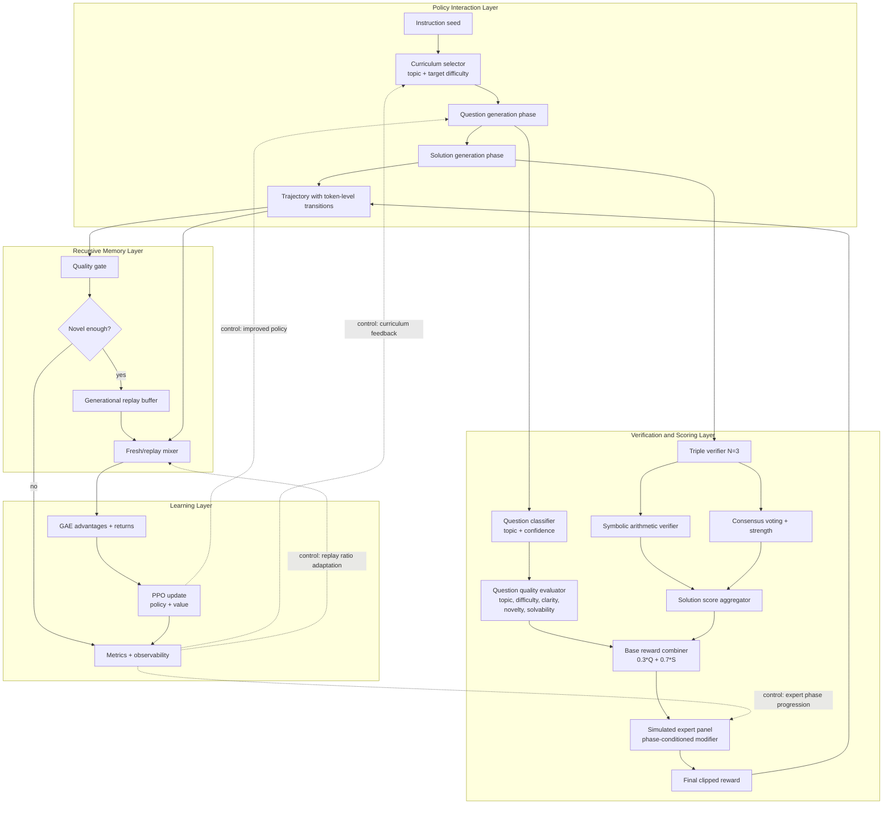
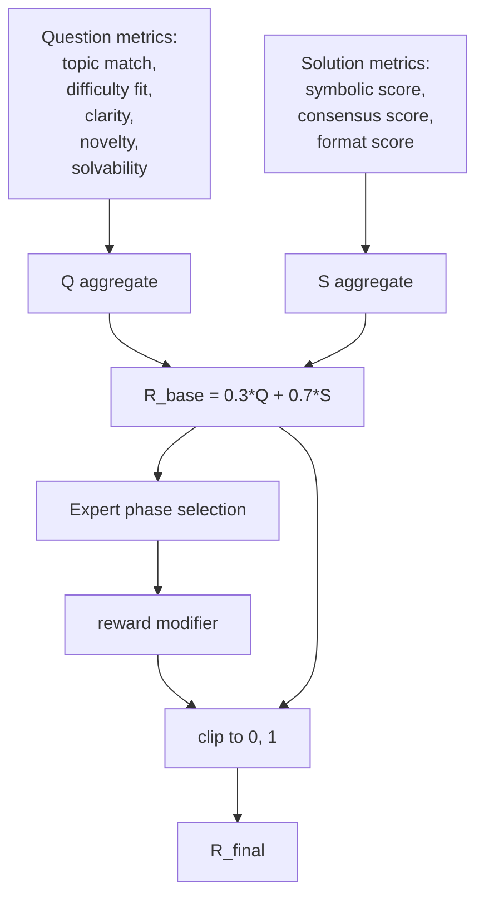
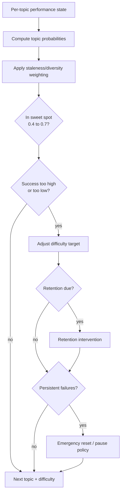

# AxiomForge-RL: Recursive Math Self-Improvement with PPO

> **OpenEnv Apr 2026 Hackathon — Theme #4: Self-Improvement**
> See [`HACKATHON.md`](HACKATHON.md) for the full rubric mapping.

## 1. Project Overview

AxiomForge-RL is a self-improving reinforcement learning system in which one language model generates math challenges, solves them, and learns from verification-driven rewards. The training loop combines curriculum learning, consensus checking, symbolic validation, and replay-based recursive training to amplify reasoning ability over generations.

Core innovation: the agent does not optimize against a fixed benchmark distribution; it continuously reshapes its own task distribution and uses internal verification signals to drive capability growth.

**Base model:** Qwen2.5-Math-1.5B-Instruct, warm-started with a dual-task SFT checkpoint.
**Environment:** curriculum-aware math arena exposed as an OpenEnv-compliant FastAPI service.
**Training:** single-GPU PPO with adaptive curriculum, triple-verifier consensus rewards, and a generational replay buffer.

### Quick links
- [Quickstart](#9-quickstart)
- [Extensive training command (1× A100 PCIE)](#91-extensive-training-1-a100-pcie)
- [Repository layout](#11-repository-layout)
- [OpenEnv / HF Space deployment](#12-openenv-deployment)
- [Before/after demo](#13-beforeafter-demo)
- [Hackathon alignment](HACKATHON.md)

---

## 2. System Architecture

### 2.1 End-to-End Architecture and Dataflow



### 2.2 Reward Computation Graph



### 2.3 Curriculum Control Flow



---

## 3. Mathematical Foundation

### 3.1 MDP Formulation

The training process is modeled as an episodic MDP over token-generation trajectories.

- **State space**: $s_t = (x_{1:t})$, the full generated prefix at step $t$ (instruction-conditioned text context).
- **Action space**: $a_t \in \mathcal{V}$, one discrete token from vocabulary $\mathcal{V}$.
- **Transition**: deterministic text append $s_{t+1} = s_t \oplus a_t$.
- **Terminal reward**: sparse reward at final token, with intermediate rewards set to zero.
- **Policy**: autoregressive LM $\pi_\theta(a_t \mid s_t)$.
- **Value function**: critic $V_\phi(s_t)$.

Dual-task structure:
1. Question generation trajectory segment.
2. Solution generation trajectory segment.  
The terminal reward is attached to the final transition of the combined segment.

### 3.2 PPO Objective

Implemented clipped PPO objective:

$$
r_t(\theta) = \frac{\pi_\theta(a_t\mid s_t)}{\pi_{\theta_{\text{old}}}(a_t\mid s_t)}
$$

$$
\mathcal{L}_{\text{policy}} =
\mathbb{E}_t\left[
\min\left(
r_t(\theta)\hat{A}_t,\,
\text{clip}\!\left(r_t(\theta),1-\epsilon,1+\epsilon\right)\hat{A}_t
\right)
\right]
$$

Value loss with clipping:

$$
\mathcal{L}_{\text{value}} =
\frac{1}{2}\,\mathbb{E}_t\left[
\max\left(
\left(V_\phi(s_t)-G_t\right)^2,\,
\left(\text{clip}\!\left(V_\phi(s_t)-V_{\phi,\text{old}}(s_t),-\epsilon_v,\epsilon_v\right)+V_{\phi,\text{old}}(s_t)-G_t\right)^2
\right)
\right]
$$

Entropy bonus:

$$
\mathcal{H}_t = -\sum_{a\in\mathcal{V}}\pi_\theta(a\mid s_t)\log\pi_\theta(a\mid s_t)
$$

Total optimization target:

$$
\mathcal{L}_{\text{total}}=
\mathcal{L}_{\text{policy}}
+ c_1\mathcal{L}_{\text{value}}
- c_2\mathbb{E}_t[\mathcal{H}_t]
$$

### 3.3 GAE Advantage Estimation

Temporal-difference residual:

$$
\delta_t = r_t + \gamma V(s_{t+1})(1-\text{done}_t) - V(s_t)
$$

Generalized advantage:

$$
\hat{A}_t = \sum_{l=0}^{T-t}(\gamma\lambda)^l\,\delta_{t+l}
$$

Return target:

$$
G_t = \hat{A}_t + V(s_t)
$$

With $\gamma=1.0$ and $\lambda=0.95$, this setup emphasizes full-episode credit assignment while controlling variance.

---

## 4. Verification Mechanisms

### 4.1 Symbolic Arithmetic Verification

Symbolic verification checks arithmetic consistency of step-by-step solutions and final-answer formatting.

Process:
1. Parse structured solution steps.
2. Symbolically verify step computations.
3. Track total steps, verified steps, failed steps, and final-answer validity.
4. Produce arithmetic score:

$$
S_{\text{sympy}}=
\begin{cases}
0 & \text{if } \text{steps\_total}=0\\
\frac{\text{steps\_verified\_ok}}{\text{steps\_total}} \cdot 0.5 & \text{if any step failed}\\
\frac{\text{steps\_verified\_ok}}{\text{steps\_total}} & \text{otherwise}
\end{cases}
$$

Failure handling: arithmetic failures do not hard-stop training; they reduce reward and can block replay admission.

### 4.2 Consensus Voting ($N=3$)

Three independently sampled solutions are generated in one batched pass for efficiency and diversity.

Answer extraction:
1. Parse each candidate final answer.
2. Convert to numeric form.
3. Round to fixed precision for stable vote counting.

Majority and strength:

$$
\text{has\_majority} \iff \text{majority\_count} \ge 2
$$

$$
S_{\text{consensus\_strength}} = \frac{\text{majority\_count}-1}{N-1}
$$

For $N=3$:
- $3/3 \rightarrow 1.0$
- $2/3 \rightarrow 0.5$
- $1/3 \rightarrow 0.0$

Consensus reward component:

$$
S_{\text{consensus}}=
\begin{cases}
\min(1.0, S_{\text{consensus\_strength}} + 0.3), & \text{if majority and primary matches majority}\\
0.2, & \text{if majority exists but primary is outlier}\\
0.1, & \text{if no majority}
\end{cases}
$$

Statistical rationale: this is a self-consistency estimator where agreement serves as a proxy for semantic correctness under independent stochastic samples.

### 4.3 Simulated Expert Panel

Three reward-shaping phases model changing expert requirements:

| Phase | Iterations | Emphasis |
|---|---:|---|
| Pedagogy | 0-3 | Clarity and solvability; mild difficulty penalty |
| Accuracy | 4-6 | Arithmetic correctness and consensus stability |
| Challenge | 7+ | Difficulty and novelty while retaining correctness |

Raw modifier:

$$
m_{\text{raw}} =
w_c C + w_s S + w_r R + w_g G + w_d D + w_n N - w_f(1-F)
$$

where $$C,S,D,N$$ are question metrics, $$R,G,F$$ are solution metrics (correctness, consensus, format).

Bounded modifier:

$$
m = \text{clip}(m_{\text{raw}}, -0.3, 0.3)
$$

---

## 5. Curriculum Learning System

### 5.1 Topic Taxonomy

The curriculum tracks 12 math reasoning families:

1. Basic arithmetic  
2. Single-step word problems  
3. Fractions  
4. Percentages  
5. Ratios and proportions  
6. Money and pricing  
7. Time/speed/distance  
8. Multi-step reasoning  
9. Algebraic unknowns  
10. Mixed operations  
11. Comparative reasoning  
12. Optimization-style word problems

Prerequisites are encoded for selected topics (for example, percentages depend on fractions; optimization depends on comparison and algebra).

### 5.2 Question Classification

Classification is multi-signal:
- Keyword overlap by topic lexicons.
- Pattern boosts (fraction and percentage regex hints).
- Solution-operation override (post-hoc operation signature from generated solution).

Difficulty estimation is post-solution:

$$
d = 0.4\,d_{\text{step}} + 0.3\,d_{\text{numeric}} + 0.3\,d_{\text{consensus}}
$$

Confidence and secondary topics are preserved for downstream scoring and analytics.

### 5.3 Goldilocks Principle

Target success interval:

$$
\mathcal{G} = [0.4,\,0.7]
$$

Difficulty target updates (after minimum evidence):
- If topic success $$>0.7$$: increase target difficulty.
- If topic success $$<0.4$$: decrease target difficulty.
- Else: hold active regime.

Selection is probabilistic with:
- Sweet-spot exploitation.
- Exploration allocation.
- Retention allocation.
- Within-iteration staleness/diversity penalties.

### 5.4 Retention Testing

Retention schedule follows exponential backoff:

$$
\Delta_k = \min(2^k, 32)
$$

where $k$ is number of passed retention tests since mastery.

Retention outcomes:
- $\ge 0.7$: stay mastered and increase interval.
- $0.4 \le r < 0.7$: demote to active.
- $< 0.4$: mark forgotten and regress difficulty target.

Persistent failure safeguards include tiered interventions (difficulty shrink, pause, emergency reset).

---

## 6. Recursive Training System

### 6.1 Replay Buffer

High-quality trajectories are admitted into generational memory under strict gating.

Admission criteria:
1. Combined reward $\ge 0.7$
2. Symbolic verification passes
3. Consensus majority exists
4. Primary answer matches majority
5. Topic-match score $\ge 0.6$

Novelty gate:
- Trigram Jaccard-based novelty against existing memory.
- Admission requires novelty score $\ge 0.7$.

Quality score used for ranking:

$$
q = 0.4\,R_{\text{combined}} + 0.3\,\mathbb{1}_{\text{sympy}} + 0.2\,S_{\text{topic\_match}} + 0.1\,S_{\text{clarity}}
$$

Capacity and pruning:
- Max capacity: 500 trajectories.
- Per-topic cap pruning, then global top-quality trim.

### 6.2 Generational Learning

Replay ratio is adaptive:
- Iterations < 3: no replay.
- Iterations 3-4: low replay.
- Later: replay share increases with buffer health.

Rollout mixing combines fresh trajectories and replay trajectories, then shuffles before PPO updates.

Buffer health composite:

$$
H_{\text{buffer}} = 0.5\,\bar{q} + 0.3\,D_{\text{topic}} + 0.2\,(1-\text{staleness\_norm})
$$

This implements a self-expanding corpus where high-quality solved examples recursively influence future policy updates.

---

## 7. Reward Calculation

### 7.1 Question Quality Score

Implemented weighted aggregation:

$$
Q = 0.25\,S_{\text{topic\_match}}
+ 0.25\,S_{\text{difficulty\_fit}}
+ 0.20\,S_{\text{clarity}}
+ 0.20\,S_{\text{solvability}}
+ 0.10\,S_{\text{novelty}}
$$

Component definitions:
- $S_{\text{topic\_match}}$ from detected vs target topic alignment.
- $S_{\text{difficulty\_fit}} = \max(0, 1 - 2|d_{\text{measured}} - d_{\text{target}}|)$.
- $S_{\text{clarity}}$ from low-cost structural heuristics.
- $S_{\text{solvability}}$ from syntax checks + symbolic verification + consensus checks.
- $S_{\text{novelty}}$ from dataset/session trigram novelty blend.

### 7.2 Solution Quality Score

$$
S = 0.4\,S_{\text{sympy}} + 0.4\,S_{\text{consensus}} + 0.2\,S_{\text{format}}
$$

Format score:

$$
S_{\text{format}} = 0.5\,\mathbb{1}_{\text{has\_steps}} + 0.5\,\mathbb{1}_{\text{has\_final\_answer}}
$$

Edge-case behavior:
- No parseable answers: low consensus fallback.
- Majority exists but primary outlier: penalized consensus score.
- Missing structured steps: format degradation.

### 7.3 Combined Base Reward

$$
R_{\text{base}} = 0.3\,Q + 0.7\,S
$$

### 7.4 Expert-Modified Reward

$$
R_{\text{final}} = \text{clip}\left(R_{\text{base}}\cdot(1+m),\,0,\,1\right), \quad m\in[-0.3,0.3]
$$

The modifier $$m$$ is phase-dependent and computed from weighted quality signals as defined in Section 4.3.

---

## 8. Implementation Components

Core modules in the system:

| Component | Purpose |
|---|---|
| Triple verification engine | Produces multi-sample solution checks and consensus statistics |
| Consensus reward engine | Combines symbolic, consensus, and format signals into solution reward |
| Topic/difficulty classifier | Detects topic family and estimates post-hoc difficulty |
| Curriculum scheduler | Maintains topic states, success rates, and adaptive selection probabilities |
| Question quality evaluator | Computes question-side reward with novelty and solvability checks |
| Simulated expert panel | Applies phase-conditioned reward modifiers |
| Generational replay memory | Stores and samples high-quality trajectories across iterations |
| Replay quality gate | Enforces admission thresholds and novelty requirements |
| Curriculum-aware environment | Executes dual-task rollouts and reward assembly |
| PPO training runner | Orchestrates rollout collection, GAE, PPO updates, evaluation, and logging |
| OpenEnv environment wrapper | Exposes the arena as `reset` / `step` / `state` over FastAPI |
| Proposer-Solver arena | Named single-method entry point for Theme #4 self-play episodes |
| ZPD difficulty controller | Introspects curriculum sweet-spot / mastered / struggling buckets |

---

## 9. Quickstart

### 9.1 Environment setup

```bash
# 1) Create the venv (Python 3.11+) and install deps
python -m venv .venv && source .venv/bin/activate
pip install -r requirements.txt

# 2) Fetch / prepare the SFT-warm-started checkpoint at checkpoints/dual_task_v1
#    (already present if you ran scripts/dual_task_sft_pipeline.py earlier)

# 3) Sanity-check a short PPO run (2 iters, 3 rollouts)
bash launch_ppo_training.sh --num-iterations 2 --rollouts-per-iter 3
```

### 9.2 Extensive training (1× A100 PCIE)

The previous command was a smoke test. Now that the loop is validated end-to-end, the recommended run for generating real reward-curve evidence on a single A100 PCIE (40 GB or 80 GB) is:

```bash
set -euo pipefail
export CUDA_VISIBLE_DEVICES=${CUDA_VISIBLE_DEVICES:-0}

python scripts/run_ppo_training_curriculum.py \
  --base-model checkpoints/dual_task_v1 \
  --output-dir checkpoints/ppo_curriculum \
  --num-iterations 50 \
  --rollouts-per-iter 32 \
  --eval-data-path data/sft/dual_task_val.jsonl \
  --gsm8k-reference-data data/sft/gsm8k_sft.jsonl \
  --checkpoint-keep-last 5 \
  --checkpoint-keep-every 10 \
  --run-name "ppo_curriculum_$(date +%Y%m%d_%H%M)"
```

**Sizing rationale (1× A100 PCIE, 1.5B policy + ValueHead in bf16):**

| Knob | Value | Why |
|---|---|---|
| `--num-iterations` | `50` | Enough iterations to draw a reward curve and see curriculum phase transitions (pedagogy -> accuracy -> challenge). |
| `--rollouts-per-iter` | `32` | Large enough for a stable PPO gradient; small enough to finish one iteration (rollout + update + logging) in ~15 min on A100 PCIE. |
| `--checkpoint-keep-last` | `5` | Lets you roll back 5 iterations if a phase transition spikes KL. |
| `--checkpoint-keep-every` | `10` | Persists milestone snapshots at iter 10/20/30/40/50 outside the rolling window. |
| *(default)* `eval_every=5` | — | Runs GSM8K eval every 5 iterations; 10 eval points over the run. |
| *(default)* `learning_rate=1e-6` | — | Conservative, tuned for PPO stability on a 1.5B LoRA model. |
| *(default)* `target_kl=0.15` | — | Early-stops the PPO epoch if the policy drifts too far. |
| *(default)* `ppo_epochs=3` | — | Standard for PPO with 32-trajectory micro-batches. |

**Expected wall-clock (post-compile, TF32 + cuDNN bench on):**

| Phase | Time per iteration |
|---|---|
| Rollouts (32× sequential) | ~12-14 min |
| PPO update (3 epochs × 96 micro-steps) | ~2-3 min |
| Logging + checkpoint | ~10-20 s |
| Eval (every 5 iters, 500 GSM8K problems, greedy) | ~6-8 min |
| **Per-iteration average** | **~16 min** |
| **Full 50-iter run** | **~13-15 hours** |

Use `nohup` + `tee` if you want to detach and monitor:

```bash
nohup bash -c 'set -euo pipefail
export CUDA_VISIBLE_DEVICES=${CUDA_VISIBLE_DEVICES:-0}
python scripts/run_ppo_training_curriculum.py \
  --base-model checkpoints/dual_task_v1 \
  --output-dir checkpoints/ppo_curriculum \
  --num-iterations 50 \
  --rollouts-per-iter 32 \
  --eval-data-path data/sft/dual_task_val.jsonl \
  --gsm8k-reference-data data/sft/gsm8k_sft.jsonl \
  --checkpoint-keep-last 5 \
  --checkpoint-keep-every 10 \
  --run-name "ppo_curriculum_$(date +%Y%m%d_%H%M)"' \
  > logs/run_$(date +%Y%m%d_%H%M).log 2>&1 &

# Follow the live log:
tail -f logs/run_*.log
```

### 9.3 Scale-down / debug presets

If you need a shorter loop for debugging a code change, shrink either axis:

```bash
# 5-iter smoke (~30 min): validates environment + training + eval
... --num-iterations 5 --rollouts-per-iter 16 --skip-initial-eval

# 10-iter medium run (~2.5 h): validates curriculum phase transitions
... --num-iterations 10 --rollouts-per-iter 24
```

### 9.4 Monitoring

CSV metrics stream to `logs/ppo-curriculum/<run-name>/`:

| File | What's in it |
|---|---|
| `ppo_metrics.csv` | `policy_loss`, `value_loss`, `approx_kl`, `clip_fraction`, `entropy`, per-iteration |
| `reward_metrics.csv` | combined / solver / proposer reward, SymPy pass rate, consensus majority rate |
| `curriculum_metrics.csv` | per-topic success rate, difficulty target, attempts, sweet-spot membership |
| `eval_metrics.csv` | GSM8K accuracy at each eval checkpoint |
| `console_output.log` | full captured stdout/stderr |

Healthy run signatures to watch for (based on validated short run):
- `approx_kl` stays below `0.1` (target is `0.15`)
- `clip_fraction` sits in `[0.10, 0.30]`
- `combined_reward` mean trends upward after ~5 iterations
- `consensus_has_majority` rate climbs above `0.5` within ~10 iterations

---

## 10. Implementation Stack

### 10.1 Training

- **Custom single-GPU PPO** ([`src/rl/ppo_trainer.py`](src/rl/ppo_trainer.py)) with GAE advantage estimation, clipped policy + value losses, entropy bonus, and early-stop on KL.
- **Rollout buffer** ([`src/rl/rollout_buffer.py`](src/rl/rollout_buffer.py)) stores per-token transitions and log-probs; `compute_advantages()` runs GAE.
- **Generational replay** ([`src/rl/replay_buffer.py`](src/rl/replay_buffer.py)) admits high-quality trajectories under strict novelty + correctness gates; mixed back into fresh rollouts with an adaptive ratio.
- **Curriculum-aware environment** ([`src/rl/math_environment_curriculum.py`](src/rl/math_environment_curriculum.py)) drives dual-task (question-gen + solution-gen) episodes.
- **PPO-training runner** ([`scripts/run_ppo_training_curriculum.py`](scripts/run_ppo_training_curriculum.py)) orchestrates rollouts, updates, eval, checkpointing, curriculum bookkeeping, and CSV logging.

Global GPU performance knobs (TF32 matmul, cuDNN benchmark) are set at import time in the training runner so every kernel benefits from them.

### 10.2 Verification (rewards)

- **Triple verifier** ([`src/rl/triple_verifier.py`](src/rl/triple_verifier.py)): samples 3 solutions per question with moderate temperature and runs majority vote.
- **Consensus reward calculator** ([`src/rl/consensus_reward_calculator.py`](src/rl/consensus_reward_calculator.py)): combines SymPy, consensus, and format signals with weights `[0.4, 0.4, 0.2]`.
- **Symbolic step verifier** ([`src/sft/step_verify_sympy.py`](src/sft/step_verify_sympy.py)): parses step-wise solutions, symbolically validates each step, and emits `steps_total / steps_verified_ok / steps_failed / final_answer`.
- **Question quality evaluator** ([`src/rl/question_quality_evaluator.py`](src/rl/question_quality_evaluator.py)): topic match, difficulty fit, clarity, novelty, solvability.
- **Expert panel** ([`src/rl/expert_panel.py`](src/rl/expert_panel.py)): phased reward-shaping modifier (pedagogy -> accuracy -> challenge).

### 10.3 Curriculum

- **Curriculum manager** ([`src/rl/curriculum_manager.py`](src/rl/curriculum_manager.py)): 12 math topics, per-topic success + difficulty state, Goldilocks sweet-spot targeting (`[0.4, 0.7]`), retention scheduling with exponential backoff, anti-stall safeguards.
- **Question classifier** ([`src/rl/question_classifier.py`](src/rl/question_classifier.py)): multi-signal topic detection (keyword, pattern, solution-operation override) + post-hoc difficulty estimate.
- **ZPD difficulty controller** ([`src/self_play/difficulty_controller.py`](src/self_play/difficulty_controller.py)): named viewport over the curriculum's sweet-spot / mastered / struggling buckets for dashboards and debugging.

### 10.4 Self-play framing (Theme #4)

- **Proposer-Solver arena** ([`src/self_play/arena.py`](src/self_play/arena.py)): single method `play_episode()` returns a pickleable `SelfPlayEpisodeResult` with explicit proposer / solver attribution and wall-clock timing.
- Same model plays both roles (implicit self-play); scoring is role-specific so the policy gets signal on *proposing good challenges* AND *solving them*.

### 10.5 OpenEnv / deployment

- **OpenEnv wrapper** ([`src/openenv/environment.py`](src/openenv/environment.py)): `reset()` / `step()` / `state()` / `close()` single-step-episode contract.
- **Pydantic wire models** ([`src/openenv/models.py`](src/openenv/models.py)): `Action`, `Observation`, `RewardBreakdown`, with range-clamped validators that act as a first line of anti-reward-hacking defense.
- **FastAPI server** ([`src/openenv/server.py`](src/openenv/server.py)): `/health`, `/metadata`, `/reset`, `/step`, `/state`, `/close`; lazy model load so Docker healthchecks pass before CUDA warms.
- **HTTP client** ([`src/openenv/client.py`](src/openenv/client.py)): blocking, context-manager-friendly, mirrors the in-process env API.
- **Docker / HF Space** ([`deployment/`](deployment/)): CUDA 12.4 runtime base, non-root UID 1000, `/data` persistent volume, ready to push as a Docker Space.

---

## 11. Repository Layout

```
Finetune_qwen/
|-- README.md                      <-- this file
|-- HACKATHON.md                   <-- rubric mapping, Theme #4 justification
|-- requirements.txt               <-- training deps (superset of deployment/requirements.txt)
|-- launch_ppo_training.sh         <-- thin launcher for PPO training
|
|-- src/
|   |-- openenv/                   <-- OpenEnv-compliant wrapper (new)
|   |   |-- environment.py         SelfImprovementMathEnv (reset/step/state)
|   |   |-- models.py              Action / Observation / RewardBreakdown (pydantic)
|   |   |-- server.py              FastAPI app
|   |   `-- client.py              HTTP client
|   |
|   |-- self_play/                 <-- Theme #4 self-play framing (new)
|   |   |-- arena.py               ProposerSolverArena
|   |   `-- difficulty_controller.py  ZPDDifficultyController
|   |
|   |-- rl/                        <-- PPO training + environment internals
|   |   |-- ppo_trainer.py         single-GPU PPO implementation
|   |   |-- rollout_buffer.py      GAE + advantage computation
|   |   |-- replay_buffer.py       generational memory with novelty gating
|   |   |-- math_environment*.py   environment classes (base, consensus, curriculum)
|   |   |-- curriculum_manager.py  adaptive curriculum state machine
|   |   |-- triple_verifier.py     N=3 consensus sampler
|   |   |-- consensus_reward_calculator.py  multi-signal reward combiner
|   |   |-- expert_panel.py        phased reward modifier
|   |   |-- question_classifier.py topic + difficulty detection
|   |   |-- question_quality_evaluator.py  question-side scoring
|   |   |-- value_network.py       ValueHead critic
|   |   |-- training_monitor.py    KL/entropy/clip monitors
|   |   |-- checkpoint_manager.py  rolling + milestone checkpoints
|   |   |-- quality_filter.py      trajectory quality gate
|   |   `-- mdp_components.py      State / Action / Transition / Trajectory dataclasses
|   |
|   |-- sft/                       <-- SFT pre-training + step verifier
|   |   |-- step_verify_sympy.py   SymPy step-level verifier
|   |   |-- solution_format.py     final-answer extraction
|   |   `-- sympy_normalize.py     answer normalization
|   |
|   `-- utils/
|       `-- csv_logger.py          per-iteration metric streaming
|
|-- scripts/
|   |-- run_ppo_training_curriculum.py   main training entrypoint
|   |-- demo_before_after.py       baseline vs trained accuracy comparison
|   |-- eval_sft_inference.py      GSM8K eval utilities (used by training)
|   |-- dual_task_sft_pipeline.py  SFT upstream pipeline
|   |-- gsm8k_sft_pipeline.py      pure-GSM8K SFT pipeline
|   |-- create_dual_task_dataset.py  dataset construction
|   `-- convert_gsm8k_to_sft.py    GSM8K parsing helper
|
|-- deployment/
|   |-- Dockerfile                 HF Space-ready image
|   |-- app.py                     Space entrypoint (defers to src.openenv.server)
|   |-- README.md                  Space YAML + usage
|   `-- requirements.txt           runtime-only deps
|
|-- data/                          SFT + eval data (JSONL)
|-- checkpoints/                   model artifacts (dual_task_v1, ppo_curriculum, ...)
|-- archives/                      historical checkpoints (safe to delete if disk is tight)
`-- logs/                          per-run CSV metrics + console output
```

---

## 12. OpenEnv deployment

### 12.1 Run the server locally

```bash
# Direct uvicorn (fast iteration):
python -m src.openenv.server --base-model checkpoints/dual_task_v1 --port 8000

# Or via Docker (what HF Spaces runs):
docker build -f deployment/Dockerfile -t self-improve-env:dev .
docker run --gpus all --rm -p 8000:7860 \
    -e BASE_MODEL=/opt/ckpt/dual_task_v1 \
    -v "$(pwd)/checkpoints/dual_task_v1:/opt/ckpt/dual_task_v1:ro" \
    self-improve-env:dev
```

Swagger UI at `http://localhost:8000/docs` (or `:7860` in Docker).

### 12.2 Use the Python client

```python
from src.openenv.client import SelfImprovementMathClient
from src.openenv.models import Action

with SelfImprovementMathClient("http://localhost:8000") as env:
    obs = env.reset()
    print(obs.instruction, obs.topic, obs.target_difficulty)

    response = env.step(Action(
        question="Maya buys 3 notebooks at $2.50 each and pays with $10. What is her change?",
        solution="3 * 2.50 = 7.50\n10 - 7.50 = 2.50\nFinal answer: 2.50",
    ))
    print(response.reward, response.reward_breakdown)
```

### 12.3 Push to a Hugging Face Space

```bash
huggingface-cli repo create <org>/self-improve-math-env --type space --space_sdk docker
git remote add space https://huggingface.co/spaces/<org>/self-improve-math-env
git subtree push --prefix deployment space main   # or push the full repo, Space uses deployment/Dockerfile
```

The `deployment/README.md` front-matter is already valid Space YAML (title, emoji, SDK=`docker`, `app_port=7860`).

---

## 13. Before/after demo

Once training produces a checkpoint, run the deterministic baseline-vs-trained comparison:

```bash
python scripts/demo_before_after.py \
    --baseline-model Qwen/Qwen2.5-Math-1.5B-Instruct \
    --trained-model checkpoints/ppo_curriculum/iteration_050/policy \
    --problems data/sft/dual_task_val.jsonl \
    --max-samples 100 \
    --records-out reports/demo_iter50.json
```

Output:

```
==============================================================================
BEFORE  vs  AFTER -- GSM8K-style accuracy (greedy)
==============================================================================
Baseline model : 42/100 (42.0%)
Trained  model : 57/100 (57.0%)
Delta          : +15 problems (+15.0 pp)

Fixed by RL : 18
Broken by RL: 3

--- Sample wins (baseline wrong -> trained right) ---
Q: ...
  gold  = 12
  before= '10'  |  after= '12'
```

Per-problem JSON records land at `reports/demo_iter50.json` for judge inspection.

---

## 14. Licensing

Apache-2.0 (see `LICENSE`). Qwen2.5-Math base weights follow the upstream Qwen license terms.